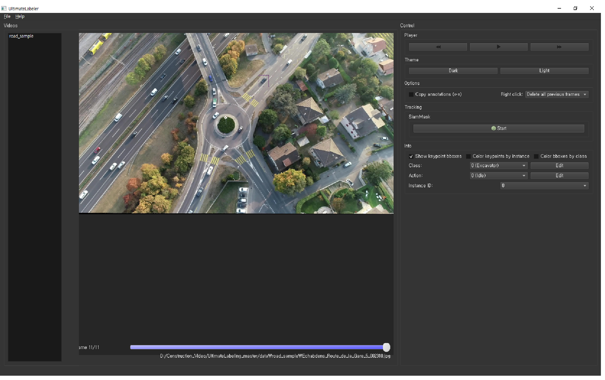
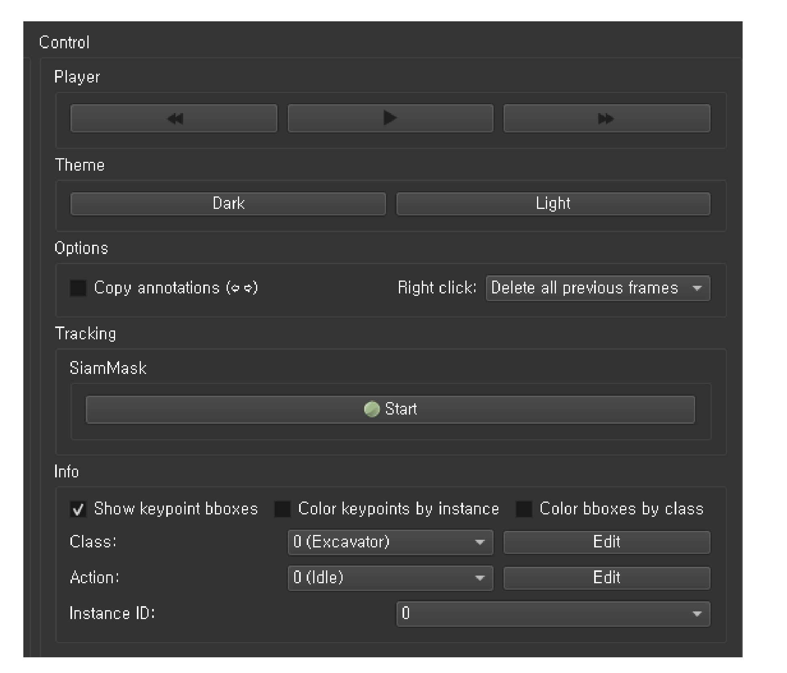
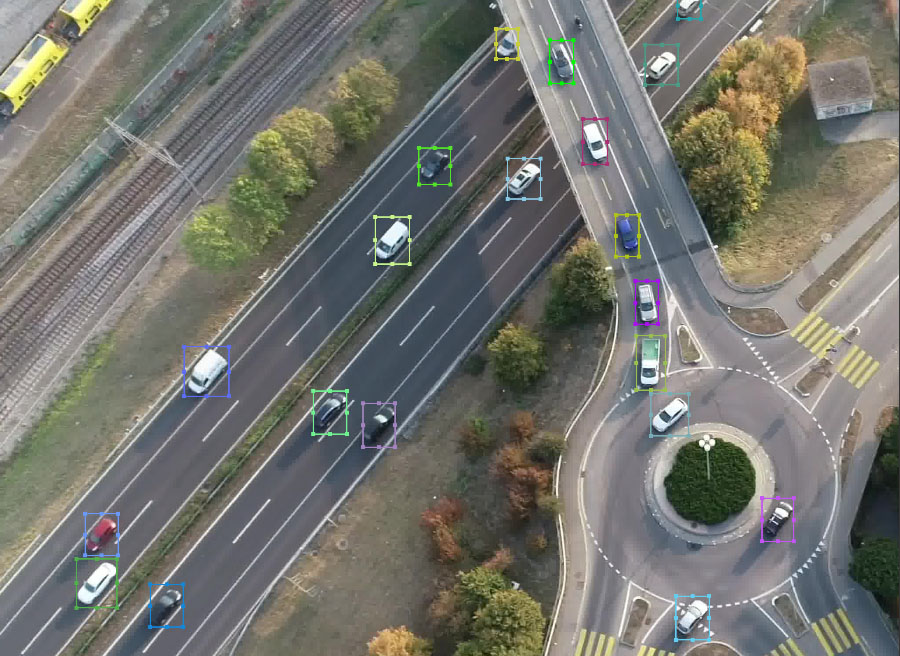
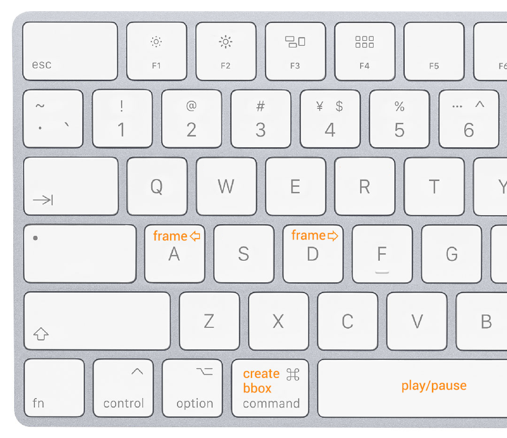

# UltimateLabeling

[](https://travis-ci.com/alexandre01/UltimateLabeling)
[](https://opensource.org/licenses/MIT)
[](https://pypi.python.org/pypi/ultimatelabeling)
[](https://pypi.python.org/pypi/ultimatelabeling) 


A multi-purpose Video Labeling (Annotation) GUI in Python with integrated with tracker. Serverless version for [ultimatelabeling](https://github.com/foolwood/SiamMask)

## Features
- Serverless SiamMask model for tracking boxes
- Customizing the Label with double class
- Zoom on video, resizable bounding boxes
- Dark mode!

## Demo 


 


The integrated object detectors and trackers are based on the following codes:
- [SiamMask](https://github.com/foolwood/SiamMask): for visual object tracking


## Installation

Start by cloning the repository on your computer (window)
```bash
git clone https://github.com/JJaewon7210/UltimateLabeling
cd UltimateLabeling
```

We recommend installing the required packages in a virtual environment to avoid any library versions conflicts. The following will do this for you:
```bash
virtualenv --no-site-packages venv
source venv/bin/activate
pip install -r requirements.txt
```

Otherwise, just install the requirements on your main Python environment using `pip` as follows:
```bash
pip install -r requirements
```

Finally, open the GUI using: 
```bash
python -m ultimatelabeling.main
```

Download the pretrained SiamMask tracking model
```bash
cd /ultimatelabeling/siamMask/pretrained
wget http://www.robots.ox.ac.uk/~qwang/SiamMask_VOT.pth -P pretrained/
```

Please check the correct path for your directory from `ultimatelabeling\config.py`
```bash
ROOT_DIR        = "D:/Construction_Video/UltimateLabeling_master/"
STATE_PATH      = ROOT_DIR + "state.pkl"
DATA_DIR        = ROOT_DIR + "data"
OUTPUT_DIR      = ROOT_DIR + "output"
RESOURCES_DIR   = ROOT_DIR + "res"
PRETRAINED_SIAM = ROOT_DIR + "ultimatelabeling/siamMask/pretrained/SiamMask_VOT.pth"
```


## Input / output

To start labeling your videos, put these (folder of images or video file, the frames will be extracted automatically) inside the `data` folder. 

- Import labels: To import existing .CSV labels, hit `Cmd+I` (or `Ctrl+I`). UltimateLabeling expects to read one .CSV file per frame, in the format: "class_id", "action_id", "xc", "yc", "w", "h".

- Export labels: The annotations are internally saved in the `output` folder. To export them in a unique .CSV file, hit `Cmd+E` (or `Ctrl+E`) and choose the destination location.

If you need other labeling option, check `ultimatelabeling\class_names.py`
```bash
DEFAULT_CLASS_NAMES = {
 0: 'Excavator',
 1: 'Truck',
 2: 'Loader',
 3: 'Roller',
 4: 'Auger',
}

DEFAULT_ACTION_NAMES = {
 0: 'Idle',
 1: 'Travel',
 2: 'Rotate',
 3: 'Dig (Excavator)',
 4: 'Unload (Excavator)',
 5: 'Dig (Loader)',
 6: 'Unload (Loader)',
 7: 'Drill (Excavator)',
 8: 'Hammer (Auger)',
 9: 'Drill (Auger)',
}
```

## Shortcuts / mouse controls



Keyboard:
- A (or Left key): next frame
- D (or Right key): previous frame
- W/S: class up/down
- T: start/stop tracking (last used tracker)
- Numberpad: assign given class_id
- Spacebar: play the video


Mouse:
- Click: select bounding box
- Click & hold: move in the image
- Cmd + click & hold: create new bounding box
- Right click: delete bounding box in current frame (+ in all previous / all following frames if the corresponding option is enabled)
- Scroll wheel (or swipe up/down): zoom in the image 


## Licence
Copyright (c) 2019 Alexandre Carlier, released under the MIT licence.
